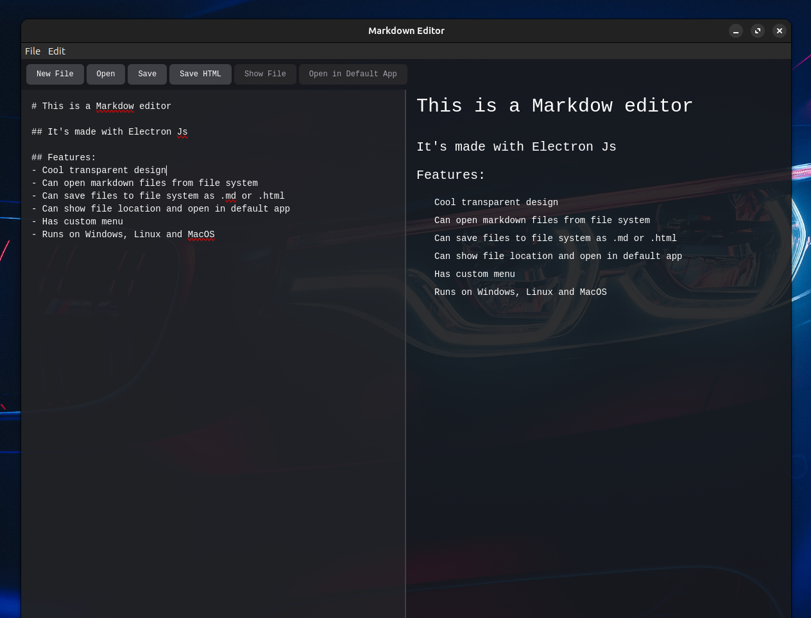

# Markdown Editor



## Setup
Make sure you have [Node.js](https://nodejs.org/) v16 or newer, [Git](https://git-scm.com/), and the [Yarn](https://yarnpkg.com/) package manager installed.

Run `npm i -g yarn` to globally install Yarn

The following commands will install the repo dependencies and start the Firesale application.
```
npm i
npm start
```